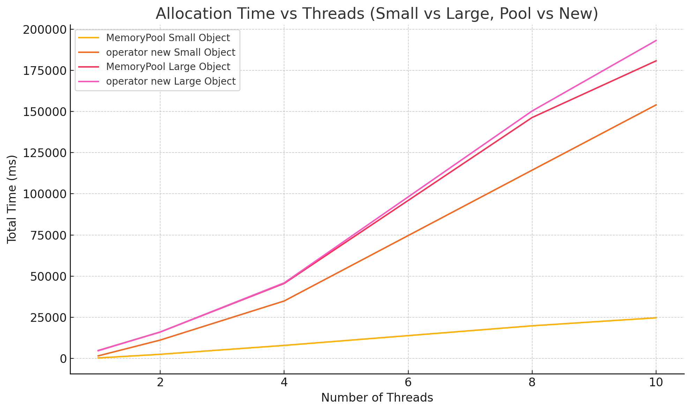

# MemoryBucket: High-Performance Memory Pool Allocator

## Overview

**MemoryBucket** is a high-performance, lock-free memory pool allocator designed for efficient memory management in C++. It is optimized for scenarios with frequent allocations and deallocations of small objects, especially in multi-threaded environments.

## Design and Logic

### 1. Segregated Memory Pools by Slot Size
- **MemoryBucket** maintains an array of 64 dedicated `MemoryPool` instances.
- Each `MemoryPool` manages memory blocks for a specific slot size, ranging from **8 bytes to 512 bytes** (in 8-byte increments).
- When you request memory of a certain size, the allocator selects the appropriate pool based on the requested size, ensuring minimal internal fragmentation and fast access.

### 2. Dedicated Free List per Pool
- Each `MemoryPool` maintains its own **lock-free free list** of slots.
- When an object is deallocated, its memory is recycled back into the pool's free list, making future allocations extremely fast (often just a pointer pop).
- This recycling greatly reduces the need to request new memory blocks from the system, minimizing allocation overhead.

### 3. Lock-Free Operations for Multi-threaded Efficiency
- The free list in each `MemoryPool` uses **lock-free atomic operations** (CAS - Compare-And-Swap) for push and pop.
- This design minimizes lock contention, allowing multiple threads to allocate and deallocate memory concurrently with minimal synchronization overhead.
- Only when a new block must be allocated is a mutex used, further reducing contention.

### 4. Large Object Handling
- For allocations **larger than 512 bytes**, `MemoryBucket` bypasses the pool and directly uses `operator new`/`operator delete`.
- This avoids unnecessary complexity and overhead for large allocations, which are less frequent and less performance-sensitive.

## Usage

- Call `MemoryBucket::initMemoryPool()` once at startup to initialize all pools.
- Use `MemoryBucket::allocate(size)` and `MemoryBucket::deallcoate(ptr, size)` for raw memory management.
- For object construction/destruction, use placement new and explicit destructor calls, or wrap with helper functions.

## Performance Results

### Test Configuration
- Allocation/Deallocation of small (≤512B) and large (>512B) objects
- Multi-threaded: 1, 5, and 10 threads
- 100 rounds, 10,000 alloc/free per round

### Results

#### 10 Threads
```
[Memory pool - Small Objects] 10 threads, 100 rounds, 10000 alloc/free per round, total time: 30733 ms
[Memory pool - Large Objects] 10 threads, 100 rounds, 10000 alloc/free per round, total time: 204151 ms
===========================================================================
[new/delete - Small Objects] 10 threads, 100 rounds, 10000 alloc/free per round, total time: 767638 ms
[new/delete - Large Objects] 10 threads, 100 rounds, 10000 alloc/free per round, total time: 202161 ms
```
#### 5 Threads
```
[Memory pool - Small Objects] 5 threads, 100 rounds, 10000 alloc/free per round, total time: 6909 ms
[Memory pool - Large Objects] 5 threads, 100 rounds, 10000 alloc/free per round, total time: 38208 ms
===========================================================================
[new/delete - Small Objects] 5 threads, 100 rounds, 10000 alloc/free per round, total time: 140340 ms
[new/delete - Large Objects] 5 threads, 100 rounds, 10000 alloc/free per round, total time: 38882 ms
```
#### 1 Thread
```
[Memory pool - Small Objects] 1 threads, 100 rounds, 10000 alloc/free per round, total time: 148 ms
[Memory pool - Large Objects] 1 threads, 100 rounds, 10000 alloc/free per round, total time: 1275 ms
===========================================================================
[new/delete - Small Objects] 1 threads, 100 rounds, 10000 alloc/free per round, total time: 1014 ms
[new/delete - Large Objects] 1 threads, 100 rounds, 10000 alloc/free per round, total time: 1163 ms
```

### Allocation Performance Comparison

The graph compares total allocation time across different thread counts for small (64B) and large (1024B) objects using `MemoryPool` and `operator new`. 

For **large objects**, both methods show similar performance because the memory pool delegates allocations ≥512B to `operator new` internally.

In contrast, for **small objects**, `MemoryPool` significantly outperforms `operator new`, especially as thread count increases, demonstrating its efficiency in managing frequent small allocations in multithreaded scenarios.
